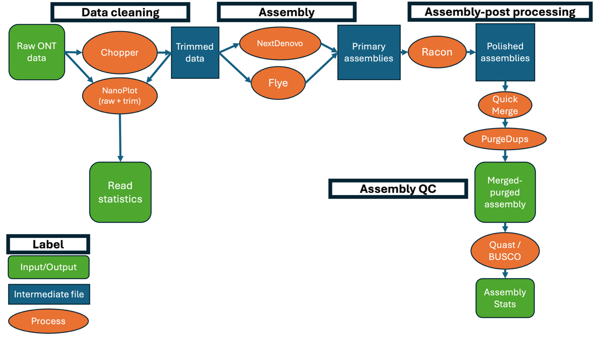

# ONTeater

A [NextFlow](https://www.nextflow.io/docs/latest/index.html)-enabled pipeline intended to produce highly-contiguous genome assemblies with only ONT input.
Illumina shortreads and PacBio longreads are optionally supported.
It can also be accessed at [workflowhub.eu](https://workflowhub.eu/workflows/1736).

## Quickstart

A genome assembly from ONT data can be run with the following command.
Note that the user should supply a rough estimate of genome size and a valid [`BUSCO`](https://busco.ezlab.org) lineage.
If genome size is not roughly known, we recommend using the [GoaT](https://goat.genomehubs.org) database to estimate from a related species.
[`NextFlow`](https://www.nextflow.io) and [`conda`](https://anaconda.org/anaconda/conda) are dependencies and assumed to be accessible inside your system.

```bash
nextflow run main.nf --ONT_rds <input.fq.gz> --genome_size 1.1 --BUSCO_lineage <valid_BUSCO_lin> --prefix <output_prefix>
```

`--workflow run` is the default and currently executes preprocessing plus primary assembly.

## Execution profiles

### Conda (default)

Uses Nextflow’s built-in conda integration (`-profile standard` or `-profile conda`). This is flexible but **solver-sensitive** across OS and CPU architecture.

```bash
nextflow run main.nf -profile standard --ONT_rds ...
```

### Docker (recommended for reproducibility)

Build a single image that contains all bioinformatics tools (Linux). From the repository root:

```bash
docker buildx build --platform linux/amd64 -t oneteater:1.0.0-amd64 -f docker/Dockerfile --load .
```

Run the pipeline with conda **disabled** so every process uses that image:

```bash
nextflow run main.nf -profile docker --ONT_rds ... --genome_size ... --BUSCO_lineage ...
```

Use a different image name or registry:

```bash
nextflow run main.nf -profile docker --container_image myregistry/oneteater:1.0.0-amd64 ...
```

**Note:** Nextflow and your input data paths still run on the host; only **task processes** execute inside the container. Mounting and file permissions follow [Nextflow’s Docker documentation](https://www.nextflow.io/docs/latest/docker.html).

For **Apple Silicon** building an image intended for **linux/amd64** clusters:

```bash
docker buildx build --platform linux/amd64 -t oneteater:1.0.0-amd64 -f docker/Dockerfile .
```

## Options

All native options in `NextFlow` are usable in `ONTeater`.
Notably, `--trace` and `--report` are useful.

|Option|Default|Data type|Description|
|---|---|---|---|
|`--help`|NA|Flag|Set to print a help message and exit.|
|`--ONT_rds`|`null`|String|A path to a gzipped file of ONT reads used for assembly.|
|`--genome_size`|`1`|Float|A value representing genome size in gigabasepairs (g). The value does not need to be precise, and can be approximated to nearest 10th - eg, `3`, or `3.2` for a human.|
|`--workflow`|`run`|String|Entry point for development/testing. Wired modes: `run`, `trim`, `assemble`, `postprocess`, `qc`.|
|`--flye_asm`|`null`|String|A path to a `Flye` assembly. Used to bypass assembly and provide genomes directly to later parts of workflow.|
|`--nd_asm`|`null`|String|A path to a `NextDenovo` assembly. Used to bypass assembly and provide genomes directly to later parts of workflow.|
|`--final_asm`|`null`|String|Path to a final assembly FASTA used when running `--workflow qc` directly.|
|`--container_image`|`oneteater:1.0.0-amd64`|String|Docker image used with `-profile docker` (override for a custom image/tag).|
|`--stub`|`false`|Flag|Run Nextflow native stub mode (`-stub-run`) for fast pipeline wiring checks.|

## High-level Description

The `ONTeater` assembly pipeline takes ONT data as an input, optionally accepting PacBio and Illumina-like paired short reads as supplemental data sources.
It begins with data visualization and trimming with `NanoPlot` and `Chopper` (v.0.7.0; Wouter de Coster and Rademakers 2023), both from the `NanoPack` series of programs.
Low-quality reads (QUAL<10), reads under 500 base pairs in length, and ONT-specific adapters are all removed.

Trimmed data then are run through two different assembly algorithms – `Flye` (v.2.9.6; Kolmogorov et al. 2019, Lin et al. 2016), an older repeat-graph based assembler, and `nextDenovo` (v.2.5.2; Jiang et al. 2024), a string-graph based assembler.
These produce different graph walks (and hence, assemblies) throughout the same sets of reads, converging in areas of high complexity, but having variable performance around the graph ‘edges’.
These two ‘primary assemblies’ are individually polished with `Racon` (v.1.5.0; Vaser et al. 2017), as well as `Pilon` (v.1.24; Walker et al. 2014), if Illumina-like shortreads are provided.

The two assemblies are then merged using `quickmerge` (v.0.3; Chakraborty et al. 2016), using the least contiguous (as measured by N50) assembly to patch gaps in the more contiguous.

We then use `purge_dups` (v.1.2.6; Guan et al. 2020) to attempt to collapse the assembly to a single haplotype.
Finally, a battery of QC tools, including but not limited to `QUAST` (v.5.2.0; Gurevich et al. 2013), `Compleasm` (v.0.2.6; Huang and Li 2023) and several in-home `Python` and `R` scripts compute summary statistics and produce figures of assembly contiguity.
Results are then written to a final output directory (`${sequence_id}_results/`) for the end-user to consume.

### Outputs

Important outputs are:

#### Preprocess (`workflow trim` and `workflow run`)

With `--prefix <prefix>`, preprocess artifacts are copied under `results/<prefix>/reads/`:

|Description|Path|
|---|---|
|Raw read NanoPlot report and plots|`results/<prefix>/reads/*_raw_NanoPlot/`|
|Filtered-read NanoPlot (after trim/filter)|`results/<prefix>/reads/*_trim_filtered_NanoPlot/`|
|Trimmed / filtered FASTQ|`results/<prefix>/reads/*_trim.fq.gz`|

#### Full pipeline (current `workflow run` target layout)

|Description|Path|
|---|---|
|Raw read summary statistics|`${sample_id}_results/reads/read_stats/raw/`|
|Trim read summary statistics|`${sample_id}_results/reads/read_stats/trim/`|
|Trimmed reads|`${sample_id}_results/reads`|
|Polished assemblies|`${sample_id}_results/assemblies`|
|Merged assembly|`${sample_id}_results/assemblies`|
|Merged-purged assembly|`${sample_id}_results/assemblies`|

#### Primary assembly outputs (`workflow assemble` and `workflow run`)

Polished assembly files are published by the `POLISH_RACON` module under:

- `results/primary_assemblies/Flye/`
- `results/primary_assemblies/nextDenovo/`

Top-level workflow outputs are grouped under `results/<prefix>/assemblies/`.

#### Postprocess and QC (`workflow postprocess`, `workflow qc`, and `workflow run`)

- `workflow postprocess` expects:
  - `--flye_asm <flye_racon.fa>`
  - `--nd_asm <nextdenovo_racon.fa>`
- `workflow qc` expects:
  - `--final_asm <final_assembly.fa>`

Outputs are currently published to:

- `results/merged_assemblies/` (merge + purged placeholders)
- `results/QC/` (QUAST + Compleasm reports)

### Stub mode

Use Nextflow native stub mode for fast wiring/tests:

```bash
./ONTeater --workflow run --ONT_rds <reads.fq.gz> --genome_size 5m --BUSCO_lineage enterobacterales --stub
```

Equivalent native Nextflow call:

```bash
nextflow run main.nf --workflow run --ONT_rds <reads.fq.gz> --genome_size 5m --BUSCO_lineage enterobacterales -stub-run
```

## Smoke test

### Conda (default profile)

```bash
./scripts/smoke_test.sh
```

By default this uses **conda** (`standard` profile) and `--workflow run`, then validates outputs under `results/smoke_direct/` and `results/smoke_wrapper/` (including `reads/`, merged assemblies, and QC paths when applicable).

Useful overrides:

- `WORKFLOW_MODE=trim ./scripts/smoke_test.sh` for preprocess-only.
- `RUN_FULL=1 ./scripts/smoke_test.sh` to additionally launch a second full `workflow run` with prefix `smoke_full`.
- `WORKFLOW_MODE=postprocess FLYE_ASM=<flye.fa> ND_ASM=<nd.fa> ./scripts/smoke_test.sh`
- `WORKFLOW_MODE=qc FINAL_ASM=<final.fa> ./scripts/smoke_test.sh`

### Docker (`docker` profile)

Separate script so Docker and conda smoke paths do not interfere:

```bash
./scripts/smoke_test_docker.sh
```

This builds `oneteater:1.0.0-amd64` from `docker/Dockerfile` if the image is missing, then runs the same checks with `-profile docker` and distinct prefixes (`smoke_direct_docker`, `smoke_wrapper_docker`).

Optional:

- `CONTAINER_IMAGE=my/oneteater:dev ./scripts/smoke_test_docker.sh`
- `SKIP_IMAGE_BUILD=1 ./scripts/smoke_test_docker.sh` if the image is already loaded locally.
- `STUB_RUN=1 ./scripts/smoke_test_docker.sh` to execute smoke with Nextflow native stubs.

### Flowchart



## Known limitations

## Installation and requirements

### Installation

The pipeline includes two dependencies: [NextFlow](https://www.nextflow.io/docs/latest/getstarted.html), and [Conda](https://conda.io/projects/conda/en/latest/user-guide/install/index.html).
You will need to install all three of these for the pipeline to run.
[Docker](https://docs.docker.com/engine/install/) is supported via the `docker` profile and `scripts/smoke_test_docker.sh`. [Singularity](https://docs.sylabs.io/guides/3.5/user-guide/introduction.html) is not wired in-tree yet.

### Requirements

The ONTeater pipeline is computationally heavy, but does not require GPU support to function.
The pipeline was primarily developed and tested on a remote OVH-BRUTE cluster with 755Gb of RAM and roughly 90 threads.
It is recommended that you run it on a cluster of similar or greater strength.

## Runtime

Overall runtime is strongly influenced by the target organism’s genome size and complexity, but scales roughly linearly with input data volume.
A representative mammalian assembly (*Stenella longirostris*, the spinner dolphin) at ~30x coverage was completed in roughly 66 hours.
More detailed statistics are in the work for this.

### Misc

Effective in recovering roughly pseudochromosomal contigs given sufficient long-read data.
We conventionally define this as >30x coverage.


Figure 2. Sample output from `visualize_contig_lengths.R` module. Each bar represents a contig, with red bars denoting contigs over 1 000 000 bp in length.
Green bars (not shown in this assembly) represent smaller ones, with the horizontal red line denoting the 1-million bp mark.
